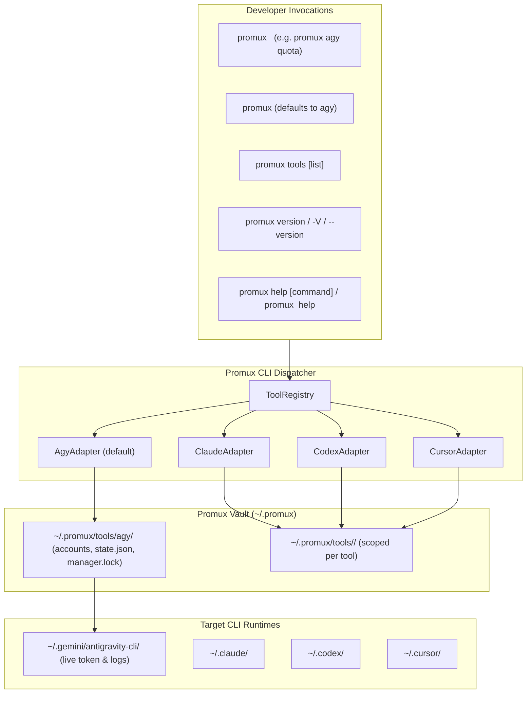
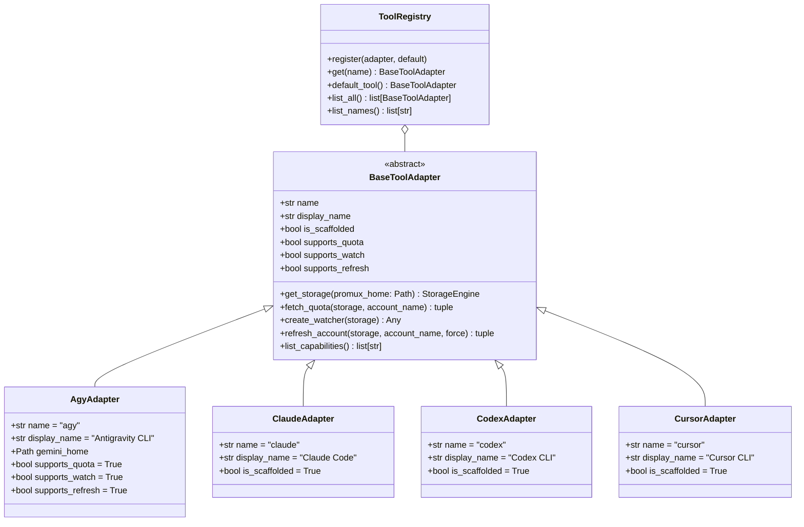

# Promux: Multi-Tool Profile Multiplexer & Quota Failover Daemon
## Architecture, Philosophy & Technical Specification

> **Package Name:** `promux`  
> **Directory:** `~/Dev/promux`  
> **Version:** 0.3.0  
> **Date:** 2026-09-11  
> **Author:** Alireza Opmc  

---

## 1. Executive Summary & Problem Space

Modern AI-assisted development utilizes multiple command-line developer tools:
- **Google Antigravity CLI (`agy`)**
- **Anthropic Claude Code (`claude`)**
- **OpenAI Codex CLI (`codex`)**
- **Cursor CLI (`cursor`)**

Each tool typically persists its active session credentials to a fixed, isolated filesystem location with no built-in mechanism for multiple profile management, zero-downtime hot-swapping, quota monitoring, or automated failover upon rate limits (`429 RESOURCE_EXHAUSTED` / `quota reached`).

**`promux`** is an extensible, non-intrusive profile multiplexer and developer utility designed to manage multiple accounts across any developer CLI tool. It provides:
1. **Multi-Tool Architecture**: Extensible adapter framework supporting `agy`, `claude`, `codex`, `cursor`, and future CLI tools.
2. **Tool-First CLI Grammar**: Unified command syntax (`promux <tool> <command>`) with 100% transparent top-level backward compatibility for default Antigravity usage (`promux <command>`).
3. **Isolated Account Vaulting**: Multi-profile storage and atomic credential swapping under POSIX file locks.
4. **Proactive Quota Inspection**: Live Cloud Code Assist quota monitoring with compact inline reset countdowns (`98.0% (2h 15m)`) for both 5-hour and weekly quota windows.
5. **Reactive Log-Tailing Failover**: Background daemon tailing logs in real-time to detect quota walls and rotate to healthy standby accounts.
6. **Resilient Concurrency & Anti-Thrashing**: POSIX file locks (`flock`), atomic `.tmp` state replacement, and cooldown timers to prevent cascading rotations.

---

## 2. Core Philosophy & Architectural Tenets



### 2.1 The Zero-Intrusion Overlay Philosophy
`promux` never modifies or patches upstream CLI binaries, nor does it intercept network traffic via local HTTP proxies. Instead, it treats the local filesystem as a mutable runtime interface. Upstream developer CLIs remain completely unaware of `promux`.

### 2.2 Strict Single-Active Model
Rather than multiplexing requests across accounts in parallel (which risks telemetry flags, token collisions, or concurrent prompt state issues), `promux` enforces **one active profile per tool** while all other accounts remain in **STANDBY**, **COOLDOWN**, or **DISABLED** states.

### 2.3 Dual-Loop Quota Awareness (Antigravity)
- **Proactive Loop**: Queries Google's internal Cloud Code Assist REST API using the stored OAuth token to evaluate account health across 5-hour and weekly windows.
- **Reactive Loop**: Tails live log files (`cli.log`, `log/*.log`). If an execution hits an unexpected quota wall, the watcher detects the error immediately and triggers hot failover.

### 2.4 Anti-Thrashing & Resilient Concurrency
- **Cooldown Timers**: When an account encounters quota exhaustion, it is assigned a cooldown period (default: 60 minutes or parsed reset duration) to prevent circular rotation loops.
- **Process Mutex**: File locking (`fcntl.flock` on POSIX systems) guards all state transitions, preventing corruption if multiple CLI calls, scripts, or daemons run concurrently.
- **Atomic File Swaps**: Metadata state (`state.json`) and live tokens are written to `.tmp` files and committed via POSIX atomic rename (`os.replace`).

### 2.5 Zero External Dependencies
`promux` is built entirely on the Python 3.10+ Standard Library (`urllib`, `json`, `fcntl`, `argparse`, `dataclasses`, `datetime`, `re`, `shutil`, `pathlib`). It requires zero third-party package dependencies at runtime.

---

## 3. Multi-Tool Adapter Architecture

### 3.1 Class Hierarchy


### 3.2 Capability Mapping & Validation
Commands map to capabilities:
- `quota`: requires `quota`
- `watch`: requires `watch`
- `refresh`: requires `refresh`
- `list`, `save`, `switch`, `next`, `whoami`, `remove`: require `vault`

If a user invokes an unsupported capability on a tool (e.g. `promux claude quota`), `promux` returns exit code 1 with:
```text
Error: Tool 'claude' does not support 'quota'. Supported capabilities: vault
```

---

## 4. Filesystem Layout & Storage Contracts

### 4.1 Directory Structure
```text
~/.promux/
├── accounts/                           # Antigravity accounts (backward-compatible)
│   ├── <account-1>/
│   │   └── antigravity-oauth-token
│   └── <account-2>/
│       └── antigravity-oauth-token
├── state.json                          # Central registry & runtime status (agy, backward-compat)
├── manager.lock                        # Concurrency mutex (agy, backward-compat)
└── tools/                              # Uniform scoped storage per developer tool
    ├── agy/                            # Antigravity CLI tool storage
    │   ├── accounts/
    │   │   └── <profile>/
    │   │       └── antigravity-oauth-token  (chmod 0600)
    │   ├── state.json
    │   └── manager.lock
    ├── claude/
    │   ├── accounts/
    │   ├── state.json
    │   └── manager.lock
    ├── codex/
    │   ├── accounts/
    │   ├── state.json
    │   └── manager.lock
    └── cursor/
        ├── accounts/
        ├── state.json
        └── manager.lock
```

> **Backward Compatibility:** The root-level `~/.promux/accounts/`, `~/.promux/state.json`, and `~/.promux/manager.lock` paths remain supported for existing `agy` deployments. New installations use `~/.promux/tools/agy/` exclusively. The `AgyAdapter.get_storage()` factory resolves the correct path automatically.

---

## 5. Quota Display & Countdown Redesign

### 5.1 Overview Table Specification
Reset times are embedded directly into each quota cell following the remaining percentage, eliminating the obsolete `NEXT RESET (UTC)` column:

```text
ACTIVE  PROFILE           GEMINI (5H)          GEMINI (WK)          CLAUDE (5H)          CLAUDE (WK)         
---------------------------------------------------------------------------------------------------------
*       work              98.0% (2h 15m)       85.0% (3d 4h)        100.0% (-)           92.5% (4d 1h)       
        personal          45.2% (35m)          62.0% (1d 8h)        80.0% (1h 10m)       75.0% (2d 6h)       
```

- If time remaining exceeds 1 day: formatted as `{days}d {hours}h` (e.g. `3d 4h`).
- If time remaining is under 24 hours: formatted as `{hours}h {minutes}m` (e.g. `2h 15m`).
- If time remaining is under 1 hour: formatted as `{minutes}m` (e.g. `35m`).
- If timestamp is missing or empty: formatted as `-` (e.g. `100.0% (-)`).

### 5.2 Single-Profile Detail Mode
```text
Quota for account 'work' (project: aicode-consumers) [ACTIVE]:

MODEL GROUP              WINDOW     REMAINING & RESET
--------------------------------------------------------------------------------
Gemini Models            5h         98.0% (2h 15m left - 14:15 UTC)
Gemini Models            weekly     85.0% (3d 4h left - Sep 12 16:00 UTC)
Claude & GPT Models      5h         100.0% (-)
Claude & GPT Models      weekly     92.5% (4d 1h left - Sep 13 18:00 UTC)
```

### 5.3 JSON Schema Extension
Quota JSON objects include both raw ISO timestamps and human-readable relative countdown strings:
```json
{
  "account": "work",
  "gemini": {
    "5h_remaining": 0.98,
    "5h_reset": "2026-09-09T14:15:00Z",
    "5h_reset_relative": "2h 15m",
    "weekly_remaining": 0.85,
    "weekly_reset": "2026-09-12T16:00:00Z",
    "weekly_reset_relative": "3d 4h"
  }
}
```

### 5.4 Smart Quota-Aware Profile Switching

#### 5.4.1 Objectives & Problem Space
Manual profile selection (`promux switch <name>`) requires developers to guess available quotas or run `promux quota` beforehand. Automated reactive failover (`promux next`) uses least-recently used (LRU) standby rotation without verifying that the standby profile actually has sufficient remaining API quota.

Smart quota-aware profile switching adds automated quota-evaluated rotation:
```bash
promux switch --smart [--model {gemini,claude,gpt}]
```
It queries live Cloud Code Assist API quotas across candidate standby accounts, filters out exhausted profiles, ranks candidates by highest available quota, hot-swaps to the best profile, and conditionally applies cooldown to the departed account.

#### 5.4.2 Candidate Filtering & Evaluation Algorithm
1. **Candidate Scope:** Queries all standby accounts in `AccountState.STANDBY` (enabled and not currently in active cooldown), strictly excluding the currently active profile.
2. **Model Evaluation:**
   - `--model gemini` (default): evaluates `gemini_5h_remaining` and `gemini_weekly_remaining`.
   - `--model claude` or `--model gpt`: evaluates `third_party_5h_remaining` and `third_party_weekly_remaining` (the shared third-party model quota bucket in Cloud Code Assist).
3. **Disqualification:** Discards candidates if the API quota fetch fails or if remaining quota fraction is non-positive (`<= 0.0`) in either 5-hour or weekly windows.
4. **Ranking Metric:**
   - **Primary:** Highest 5-hour available quota fraction (`five_hour_remaining` descending).
   - **Secondary:** Highest weekly available quota fraction (`weekly_remaining` descending).
   - **Tertiary (tie-breaker):** Least-recently used (oldest `last_used_at` ascending, `None` prioritized).
5. **Conditional Cooldown on Departing Account:**
   - If the active account being rotated away from has exhausted quota (`<= 0.0` in 5-hour or weekly window for the evaluated model tier), it is quarantined into cooldown using its parsed reset timestamp (or a 60-minute default).
   - If the departing active account retains positive quota (> 0% in both windows), it remains in a clean `STANDBY` state without cooldown.
6. **Zero-Candidate Handling:** If no standby accounts have available quota, no switch occurs, a descriptive error message is returned to `stderr` (or structured error via `--json`), and exit code 1 is returned.

#### 5.4.3 Data Model & JSON Schema
The `SmartRotationResult` dataclass extends `RotationResult` with target model and evaluated quota metrics:
```json
{
  "success": true,
  "from_account": "main",
  "to_account": "backup1",
  "model": "gemini",
  "quota": {
    "5h_remaining": 1.0,
    "weekly_remaining": 0.95
  },
  "cooldown_until": null
}
```

---

## 6. Command Line Interface (CLI) Contract

### 6.1 Invocation Modes
1. **Tool-First Mode:**
   ```bash
   promux <tool> <command> [args...]
   ```
   Examples: `promux agy list`, `promux claude switch personal`, `promux agy quota`
2. **Backward-Compatible Default Mode:**
   ```bash
   promux <command> [args...]
   ```
   When the first argument is a command name (`list`, `save`, `switch`, `next`, `quota`, `refresh`, `whoami`, `remove`, `watch`, `completion`, `version`, `help`), it automatically defaults to `agy`.
3. **Tool Inspection:**
   ```bash
   promux tools [list] [--json]
   ```
4. **Version Shorthand:**
   ```bash
   promux -V
   promux --version
   ```
5. **Tool-Scoped Help:**
   ```bash
   promux <tool> help       # e.g. promux claude help
   ```

### 6.2 Subcommand Matrix
| Command | Arguments | Flags | Capabilities Required | Description |
| :--- | :--- | :--- | :--- | :--- |
| `tools` | `[list]` | `--json` | None | List registered CLI tools and capabilities |
| `list` | None | `--json` | `vault` | List all accounts in the vault for the selected tool |
| `save` | `<name>` | `--email` | `vault` | Save active credentials into the vault |
| `switch`| `[<name>]` | `--smart`, `--model`, `--json` | `vault` | Hot-swap active profile credentials, or auto-switch to highest quota with `--smart` |
| `next` | None | `--reason`, `--cooldown`, `--json` | `vault` | Rotate to next eligible standby account |
| `quota` | `[name]` | `--json` | `quota` | Inspect live quota and reset countdowns |
| `refresh`| `[name]` | `--force`, `--json` | `refresh` | Refresh OAuth access tokens |
| `whoami`| None | `--json` | `vault` | Display active profile details |
| `remove`| `<name>` | None | `vault` | Remove an account from the vault |
| `watch` | None | `--poll-seconds`, `--cooldown` | `watch` | Start log tailing failover daemon |
| `completion` | `<shell>`| None | None | Generate bash/zsh autocomplete script |
| `version` | None | `--json`, `--no-color` | None | Print version, Python, platform, and tool list |
| `help` | `[command]` | `--no-color` | None | Display grouped help or per-subcommand help |

### 6.3 Color Output & NO_COLOR Contract
`promux` emits ANSI color accents in `help` and `version` output. Colors are disabled when any of the following conditions is met (evaluated in order):

| Condition | Effect |
| :--- | :--- |
| `stdout` is not a TTY (piped/redirected) | Colors suppressed |
| `NO_COLOR` environment variable is set (any value) | Colors suppressed |
| `TERM=dumb` environment variable | Colors suppressed |
| `--no-color` CLI flag passed | Colors suppressed |

The `--no-color` flag is available on all top-level commands. This follows the [NO_COLOR](https://no-color.org/) standard.

---

## 7. Package Blueprint & Modular Structure

```text
~/Dev/promux/
├── pyproject.toml              # PEP 517/621 packaging metadata & CLI entrypoint
├── LICENSE                     # MIT License
├── README.md                   # Documentation & guide
├── SPEC.md                     # This architectural specification
├── src/
│   └── promux/
│       ├── __init__.py         # Package version and root exports
│       ├── adapters/           # Multi-tool adapter framework
│       │   ├── __init__.py     # get_default_registry factory and exports
│       │   ├── base.py         # BaseToolAdapter abstract base class
│       │   ├── agy.py          # AgyAdapter (Antigravity CLI)
│       │   ├── stubs.py        # ClaudeAdapter, CodexAdapter, CursorAdapter
│       │   └── registry.py     # ToolRegistry implementation
│       ├── constants.py        # Default paths, endpoints, regexes, timeouts
│       ├── models.py           # Dataclasses (AccountMeta, QuotaSummary, etc.)
│       ├── formatters.py       # ISO timestamp parsing & relative countdown formatting
│       ├── lock.py             # POSIX file locking (fcntl)
│       ├── storage.py          # State persistence, atomic JSON writes, profile copy
│       ├── quota.py            # Google Cloud Code Assist REST API client
│       ├── failover.py         # Candidate selection & cooldown rotation coordinator
│       ├── watch.py            # Reactive log watcher stream processor
│       ├── completion.py       # Shell auto-completion generators (bash/zsh)
│       └── cli.py              # Tool-first CLI dispatcher and command handlers
└── tests/
    ├── conftest.py             # Shared fixtures and sandbox environments
    ├── test_adapters.py        # Adapter hierarchy and registry tests
    ├── test_cli.py             # CLI dispatch, routing, and command tests
    ├── test_completion.py      # Shell completion syntax and keyword tests
    ├── test_failover.py        # Failover and cooldown rotation tests
    ├── test_formatters.py      # Reset countdown and formatting tests
    ├── test_lock.py            # File lock concurrency tests
    ├── test_models.py          # Dataclass serialization and properties tests
    ├── test_quota.py           # Cloud Code Assist API mock tests
    ├── test_storage.py         # Profile persistence and atomic swap tests
    └── test_watch.py           # Log stream pattern detection tests
```
