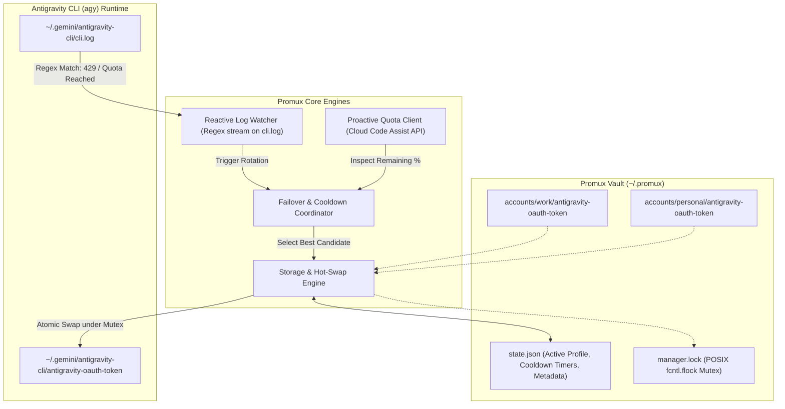
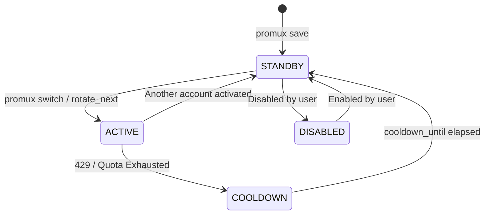

# Promux: Profile Multiplexer & Quota Failover Daemon
## Architecture, Philosophy & Technical Specification

> **Package Name:** `promux`  
> **Directory:** `~/Dev/promux`  
> **Version:** 1.0.0  
> **Date:** 2026-08-31  
> **Author:** Alireza Opmc  

---

## 1. Executive Summary & Problem Space

The **Antigravity CLI (`agy`)** stores its active OAuth session token exclusively in a single filesystem path (`~/.gemini/antigravity-cli/antigravity-oauth-token`). It provides no native multi-account vault, no profile switching command, and no automated failover mechanism when an account hits quota exhaustion (`429 RESOURCE_EXHAUSTED` / `Individual quota reached`).

**`promux`** is an external, non-intrusive profile multiplexer and automated failover daemon designed to manage multiple Antigravity accounts seamlessly. It provides:
1. **Isolated Account Vaulting**: Multi-profile storage and zero-downtime hot swapping.
2. **Proactive Quota Inspection**: Direct REST client querying Google Cloud Code Assist backend APIs to inspect remaining quota fractions and reset countdowns.
3. **Reactive Log-Tailing Failover**: Background daemon that streams `cli.log` to instantly detect quota limits and rotate to healthy standby accounts.
4. **Resilient Concurrency & Anti-Thrashing**: POSIX file locks (`flock`), atomic state writes, and cooldown timers to prevent cascading rotations.

---

## 2. Core Philosophy & Architectural Tenets



### 2.1 The Zero-Intrusion Overlay Philosophy
`promux` never modifies or patches the `agy` binary, nor does it intercept network traffic via a proxy. Instead, it treats the local filesystem (`~/.gemini/`) as a mutable runtime interface. `agy` remains completely unaware of `promux`.

### 2.2 Strict Single-Active Model
Rather than multiplexing requests across accounts in parallel (which risks telemetry flags, token collisions, or concurrent prompt state issues), `promux` enforces **one active profile** while all other accounts remain in **STANDBY**, **COOLDOWN**, or **DISABLED** states.

### 2.3 Dual-Loop Quota Awareness
- **Proactive Loop**: Queries Google's internal Cloud Code Assist REST API using the stored OAuth token to evaluate account health (short-window % remaining, weekly % remaining, prompt credits).
- **Reactive Loop**: Tails live log files (`cli.log`, `log/*.log`). If a generation in `agy` hits an unexpected quota wall, the watcher detects the error immediately and triggers hot failover.

### 2.4 Anti-Thrashing & Resilient Concurrency
- **Cooldown Timers**: When an account encounters quota exhaustion, it is assigned a cooldown period (default: 60 minutes or parsed reset duration) to prevent circular rotation loops.
- **Process Mutex**: File locking (`fcntl.flock` on Linux/macOS, `msvcrt.locking` on Windows) guards all state transitions, preventing corruption if multiple CLI calls, scripts, or daemons run concurrently.
- **Atomic File Swaps**: Metadata state (`state.json`) is written to `.tmp` files and committed via POSIX atomic rename (`os.replace`).

### 2.5 Zero External Dependencies
`promux` is built entirely on the Python 3.10+ Standard Library (`urllib`, `json`, `fcntl`, `subprocess`, `argparse`, `dataclasses`, `re`, `shutil`, `pathlib`). It requires no third-party package installations, eliminating virtual environment bloat and dependency drift.

---

## 3. Filesystem Layout & Storage Contracts

### 3.1 Directory Structure
```text
~/.promux/
├── accounts/
│   ├── <account-name-1>/
│   │   └── antigravity-oauth-token     # Isolated profile token snapshot
│   └── <account-name-2>/
│       └── antigravity-oauth-token
├── state.json                          # Central registry & runtime status
└── manager.lock                        # Concurrency mutex
```

### 3.2 `state.json` Schema
```json
{
  "active": "work-account",
  "accounts": {
    "work-account": {
      "name": "work-account",
      "enabled": true,
      "cooldown_until": null,
      "saved_at": "2026-08-31T20:00:00+00:00",
      "last_used_at": "2026-08-31T21:00:00+00:00",
      "email": "developer@work.com",
      "project_id": "projects/work-project-123",
      "plan_type": "STANDARD"
    },
    "personal-account": {
      "name": "personal-account",
      "enabled": true,
      "cooldown_until": "2026-08-31T22:00:00+00:00",
      "saved_at": "2026-08-31T19:30:00+00:00",
      "last_used_at": "2026-08-31T20:45:00+00:00",
      "email": "me@personal.org",
      "project_id": "projects/personal-project-456",
      "plan_type": "STANDARD"
    }
  }
}
```

### 3.3 Account Lifecycle State Machine


---

## 4. Google Cloud Code Assist API Integration

`promux` interfaces with Google's Cloud Code Assist backend to inspect quota allocations.

### 4.1 Endpoints
- **Base URL:** `https://cloudcode-pa.googleapis.com`
- **User-Agent:** `antigravity`
- **Headers:** `Authorization: Bearer <access_token>`, `Content-Type: application/json`

### 4.2 Step 1: Load Cloud Code Metadata & Resolve Project ID
- **Endpoint:** `POST /v1internal:loadCodeAssist`
- **Request Payload:**
  ```json
  {
    "metadata": {
      "ideType": "ANTIGRAVITY",
      "platform": "PLATFORM_UNSPECIFIED",
      "pluginType": "GEMINI"
    }
  }
  ```
- **Response Extraction:**
  - `cloudaicompanionProject`: Can be a string (`"projects/123456"`) or an object (`{"id": "projects/123456"}`).
  - `planInfo.planType`: e.g. `"STANDARD"` or `"ENTERPRISE"`.
  - `planInfo.monthlyPromptCredits`: Monthly allocated prompt credits.
  - `availablePromptCredits`: Current available credits.

### 4.3 Step 2: Retrieve Quota Summary
- **Endpoint:** `POST /v1internal:retrieveUserQuotaSummary`
- **Request Payload:**
  ```json
  {
    "project": "<cloudaicompanionProject>"
  }
  ```
- **Response Structure & Bucket Parsing:**
  ```json
  {
    "groups": [
      {
        "name": "short_window",
        "buckets": [
          {
            "name": "model_requests",
            "remainingFraction": 0.85,
            "resetTime": "2026-08-31T22:00:00Z"
          }
        ]
      }
    ]
  }
  ```

---

## 5. Reactive Log Watcher Specification

The watcher daemon tails `~/.gemini/antigravity-cli/cli.log` and `~/.gemini/antigravity-cli/log/*.log`.

### 5.1 Regex Signatures
| Pattern Name | Regular Expression | Description |
| :--- | :--- | :--- |
| `INDIVIDUAL_QUOTA` | `(?i)Individual quota reached` | Per-user model quota exhausted |
| `RESOURCE_EXHAUSTED`| `(?i)RESOURCE_EXHAUSTED\s*\(\s*code\s*429\s*\)\|RESOURCE_EXHAUSTED` | Standard 429 quota error |
| `WEEKLY_QUOTA` | `(?i)weekly quota reached` | Extended weekly window exhaustion |
| `RESET_HINT` | `(?i)Resets in\s+(?P<reset>~?[^.)]+)` | Extracts human-readable reset duration |

### 5.2 Stream Processing Algorithm
1. Open log file and seek to `EOF` at startup (avoids replaying historical errors).
2. Store byte offsets per file path.
3. Poll at configured interval (default: `1.0s`).
4. If file size drops below last known offset, handle log rotation (`offset = 0`).
5. Read new lines; if any line matches quota patterns, trigger immediate failover.

---

## 6. Command Line Interface (CLI) Contract

```text
promux [global-flags] <subcommand> [args]
```

### 6.1 Subcommand Matrix

| Command | Arguments | Flags | Output / Behavior |
| :--- | :--- | :--- | :--- |
| `list` | None | `--json` | ASCII table or JSON view of all accounts, status, cooldowns |
| `save` | `<name>` | None | Saves current live token as named profile; resolves email |
| `switch` | `<name>` | None | Hot-swaps specified account into live `.gemini` path |
| `next` | None | `--reason`, `--cooldown`, `--json` | Rotates to next eligible standby account |
| `quota` | `[name]` | `--json` | Queries Cloud Code API and displays remaining % & resets |
| `whoami` | None | `--json` | Shows email, account name, token path, and expiration |
| `remove` | `<name>` | None | Removes account from vault and state registry |
| `watch` | None | `--poll-seconds`, `--cooldown` | Starts foreground daemon tailing logs for 429 failover |

---

## 7. Package Blueprint & Modular Structure

When implementing `promux`, the codebase should be organized into single-responsibility modules:

```text
~/Dev/promux/
├── SPEC.md                     # This full architectural specification
├── pyproject.toml              # PEP 517/621 packaging metadata & CLI entrypoint
├── LICENSE                     # MIT License
├── README.md                   # Documentation, badges, quickstart
├── .gitignore
├── .github/workflows/
│   ├── test.yml                # CI: pytest on Python 3.10 - 3.13
│   └── publish.yml             # CD: PyPI Trusted Publishing on GitHub Release
├── src/
│   └── promux/
│       ├── __init__.py         # Version (__version__ = "0.1.0") and public API
│       ├── constants.py        # Default paths, endpoints, regexes, timeouts
│       ├── models.py           # Dataclasses (AccountMeta, QuotaSummary, RotationResult)
│       ├── lock.py             # fcntl/msvcrt cross-platform file locking
│       ├── storage.py          # State persistence, atomic JSON writes, profile copy
│       ├── quota.py            # Google Cloud Code Assist REST API client
│       ├── failover.py         # Candidate selection & cooldown rotation coordinator
│       ├── watch.py            # Reactive log watcher stream processor
│       └── cli.py              # Argparse interface with table & JSON formatters
└── tests/
    ├── conftest.py             # Mock fixtures for temporary homes and tokens
    ├── test_lock.py            # Concurrency mutex tests
    ├── test_storage.py         # State persistence & profile swapping tests
    ├── test_quota.py           # Cloud Code API parsing tests (mocked HTTP)
    ├── test_failover.py        # Active-standby rotation & cooldown tests
    ├── test_watch.py           # Log pattern matching & stream tailing tests
    └── test_cli.py             # End-to-end CLI execution tests
```

---

## 8. Verification & Test Plan

Any implementation of this specification should be verified against:

1. **Unit Testing**:
   - `pytest` test suite with 100% mocked network calls (`_http_post`) and sandboxed directories (`tmp_path`).
   - Mocking quota JSON responses to verify short-window and weekly bucket calculation.
   - Concurrency tests verifying lock acquisition and mutual exclusion.

2. **Integration Verification**:
   - `promux save <name>` correctly copies `~/.gemini/antigravity-cli/antigravity-oauth-token`.
   - `promux switch <name>` hot-swaps active profile.
   - `promux quota` parses live Cloud Code responses accurately.
   - `promux watch` reacts to simulated log appends of `Individual quota reached` within 1 second.
