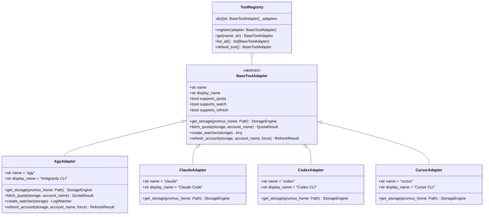

# Multi-Tool Generalization & Quota Reset Redesign Specification

**Date:** 2026-09-08  
**Status:** Approved for implementation planning  
**Authors:** Antigravity & Alireza Opmc  

---

## 1. Executive Summary & Goals

`promux` was originally developed as a profile multiplexer and failover daemon specifically coupled to the Antigravity CLI (`agy`). As AI-assisted development has expanded to include tools such as **Claude Code (`claude`)**, **Codex CLI (`codex`)**, and **Cursor CLI (`cursor`)**, developers require a unified, professional profile manager and utility tool capable of managing credentials, active sessions, and usage metrics across multiple developer CLI tools.

This specification details two primary architectural enhancements:
1. **Multi-Tool Generalization (Extensible Adapter Architecture)**:
   - Restructure `promux` from a monolithic `agy`-specific tool into an extensible tool registry with pluggable adapters.
   - Enable tool-first CLI syntax (`promux <tool> <subcommand>`, e.g. `promux agy quota`, `promux claude switch work`) while preserving 100% backward compatibility by defaulting `promux <subcommand>` (e.g. `promux quota`, `promux switch`) to `agy`.
   - Maintain `agy` as the primary fully implemented tool, with clear, robust architectural scaffolding for `claude`, `codex`, and `cursor`.
2. **Quota Command Redesign (Accurate Multi-Window Reset Display)**:
   - Eliminate the previous broken and truncated `NEXT RESET (UTC)` table column that only showed a single 5h reset time and dropped weekly resets.
   - Redesign both table overview and single-profile detail modes so that every quota bucket shows its accurate reset time directly following the remaining percentage:
     - **Overview table**: Space-separated compact notation, e.g. `98.0% (2h 15m)` for 5h and `85.0% (3d 4h)` for weekly.
     - **Detail mode**: Comprehensive breakdown with countdown and absolute UTC timestamp, e.g. `98.0% (2h 15m left - 03:15 UTC)` and `85.0% (3d 4h left - Sep 14 12:00 UTC)`.
     - **Machine output**: Extended `--json` output containing relative countdowns and humanized formatted strings.

---

## 2. CLI Command Structure & Routing

### 2.1 Command Routing Grammar

The CLI parser supports two invocation modes:
1. **Tool-First Mode**:
   ```bash
   promux <tool> <command> [args...]
   ```
   *Examples:*
   - `promux agy list`
   - `promux agy switch work`
   - `promux agy quota`
   - `promux claude switch personal`
   - `promux tools` / `promux tools list`
2. **Default Backward-Compatible Mode**:
   ```bash
   promux <command> [args...]
   ```
   *Behavior:* If the first positional argument matches a known command (`list`, `save`, `switch`, `next`, `quota`, `refresh`, `whoami`, `remove`, `watch`, `completion`) rather than a registered tool name, `promux` transparently delegates to the default tool adapter (`agy`).

### 2.2 Tool Inspection Command (`promux tools`)
A new top-level command `promux tools` lists all registered adapters:
```text
TOOL      NAME                  ACTIVE PROFILE  CAPABILITIES
-------------------------------------------------------------------------
agy       Antigravity CLI       work            vault, quota, watch, refresh
claude    Claude Code           -               vault (scaffolded)
codex     Codex CLI             -               vault (scaffolded)
cursor    Cursor CLI            -               vault (scaffolded)
```

---

## 3. Tool Adapter Architecture



### 3.1 `BaseToolAdapter` Interface (`src/promux/adapters/base.py`)
```python
from abc import ABC, abstractmethod
from pathlib import Path
from typing import Any
from promux.models import QuotaSummary
from promux.storage import StorageEngine


class BaseToolAdapter(ABC):
    name: str
    display_name: str

    @abstractmethod
    def get_storage(self, promux_home: Path | None = None) -> StorageEngine:
        """Return the scoped StorageEngine configured for this tool."""
        raise NotImplementedError

    @property
    def supports_quota(self) -> bool:
        return False

    def fetch_quota(
        self, storage: StorageEngine, account_name: str
    ) -> tuple[QuotaSummary | None, str | None, str | None]:
        return None, None, f"Quota inspection not supported for {self.display_name}."

    @property
    def supports_watch(self) -> bool:
        return False

    def create_watcher(self, storage: StorageEngine) -> Any:
        raise NotImplementedError(f"Log watching not supported for {self.display_name}.")

    @property
    def supports_refresh(self) -> bool:
        return False

    def refresh_account(
        self, storage: StorageEngine, account_name: str, force: bool = False
    ) -> tuple[bool, str]:
        return False, f"Token refresh not supported for {self.display_name}."
```

### 3.2 Concrete `AgyAdapter` (`src/promux/adapters/agy.py`)
Encapsulates:
- Antigravity live paths (`GEMINI_CLI_HOME / antigravity-oauth-token`, `cli.log`).
- Cloud Code Assist REST Client integration (`fetch_quota`).
- Reactive Log Watcher (`LogWatcher`).
- Two-Tier Token Refresh (`refresh_account`).
- Backward-compatible storage resolution (checks legacy `~/.promux/accounts` first to maintain zero-migration operation).

### 3.3 Scaffolding for `claude`, `codex`, `cursor` (`src/promux/adapters/stubs.py`)
- Defines standard tool metadata and standard target paths.
- Ready for active profile management and auth copying as upstream specs are finalized.

---

## 4. Quota Reset Formatting Specification

### 4.1 Relative Duration Formatting Logic (`src/promux/formatters.py`)
Given an ISO 8601 UTC timestamp string (e.g. `2026-09-09T03:15:00Z`), the calculation proceeds as follows:
1. Parse ISO timestamp into a timezone-aware UTC `datetime`.
2. Compute `delta = reset_dt - now_utc`.
3. If `delta <= timedelta(0)`: return `(0m)` (or `(0m left)` in detail mode).
4. Extract `days = delta.days`, `hours = delta.seconds // 3600`, `minutes = (delta.seconds % 3600) // 60`.
5. Format relative string:
   - If `days > 0`: `f"{days}d {hours}h"`
   - If `days == 0 and hours > 0`: `f"{hours}h {minutes}m"`
   - If `days == 0 and hours == 0`: `f"{minutes}m"`

### 4.2 Absolute Timestamp Formatting Logic
- For short windows (within 24 hours): `HH:MM UTC` (e.g. `03:15 UTC`).
- For longer / weekly windows: `MMM DD HH:MM UTC` (e.g. `Sep 14 12:00 UTC`).

### 4.3 Quota Cell Formatting Rules
- **Remaining Fraction**: Formatted to one decimal place: `f"{val * 100:.1f}%"`.
- **Table Cell**:
  - When reset time exists: `f"{pct_str} ({relative})"` (e.g. `98.0% (2h 15m)`, `85.0% (3d 4h)`).
  - When no reset time or unmetered: `f"{pct_str} (-)"`.
  - On auth error: `[AUTH ERROR]`.
  - On generic error: `[ERROR]`.
- **Detail Row**:
  - When reset time exists: `f"{pct_str} ({relative} left - {abs_time})"` (e.g. `98.0% (2h 15m left - 03:15 UTC)`).
  - When no reset time: `f"{pct_str} (-)"`.

### 4.4 Example Table Layouts

#### Multi-Profile Table Overview
```text
ACTIVE  PROFILE           GEMINI (5H)          GEMINI (WK)          CLAUDE (5H)          CLAUDE (WK)        
--------------------------------------------------------------------------------------------------------
*       work              98.0% (2h 15m)       85.0% (3d 4h)        100.0% (-)           92.5% (5d 12h)     
        personal          45.2% (48m)          62.0% (1d 8h)        100.0% (-)           100.0% (-)         
        backup            100.0% (-)           100.0% (-)           100.0% (-)           100.0% (-)         
```

#### Single-Profile Detail View
```text
Quota for account 'work' (project: companion-work-123) [ACTIVE]:

MODEL GROUP              WINDOW     REMAINING & RESET
--------------------------------------------------------------------------------
Gemini Models            5h         98.0% (2h 15m left - 03:15 UTC)
Gemini Models            weekly     85.0% (3d 4h left - Sep 14 12:00 UTC)
Claude & GPT Models      5h         100.0% (-)
Claude & GPT Models      weekly     92.5% (5d 12h left - Sep 14 02:00 UTC)
```

---

## 5. Storage Architecture & Multi-Tool Isolation

1. **Storage Directory Hierarchy**:
   ```text
   ~/.promux/
   ├── accounts/                         # Default legacy accounts (Agy backward compat)
   ├── state.json                        # Default legacy state
   ├── manager.lock                      # Default mutex
   └── tools/
       ├── agy/                          # Isolated Agy storage (symlinked or mapped to root)
       ├── claude/
       │   ├── accounts/
       │   ├── state.json
       │   └── manager.lock
       ├── codex/
       │   ├── accounts/
       │   ├── state.json
       │   └── manager.lock
       └── cursor/
           ├── accounts/
           ├── state.json
           └── manager.lock
   ```
2. **Backward Compatibility Guarantee**:
   If an existing user already has `~/.promux/accounts`, `AgyAdapter` operates seamlessly on `~/.promux/` directly without requiring any migration step.

---

## 6. Testing Strategy

1. **Formatters Unit Tests (`tests/test_formatters.py`)**:
   - Relative countdown calculation across minutes, hours, days.
   - Handling of boundary conditions (zero delta, negative/expired delta, malformed ISO strings, leap year/month boundaries).
   - Absolute UTC timestamp rendering.
   - Combined cell formatting (`pct + reset`).
2. **Adapter & Registry Tests (`tests/test_adapters.py`)**:
   - Registration and retrieval of adapters.
   - Default tool fallback (`agy`).
   - Storage isolation per tool.
   - Unsupported capability handling for stubs.
3. **CLI Integration Tests (`tests/test_cli.py`)**:
   - `promux agy <command>` execution.
   - `promux <command>` fallback to `agy`.
   - `promux tools` command output.
   - `promux quota` updated column headers and cell values (verifying removal of the isolated `NEXT RESET` column and presence of reset times next to `%`).
   - `--json` schema validation with added reset relative fields.
